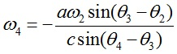
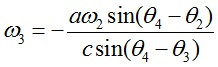

## Velocity analysis of four bar mechanism

Velocity analysis of four bar mechanism
Let ω2, ω3 and ω4 be the angular velocities of the links 2,3 and 4 respectively.
ω2 is the input angular velocity of the link 2. Since the link lengths a, b and c are known and for the given
θ2 value, θ3 and θ4 can be determined using position analysis. The
angular velocities ω3 and ω4 are given by

 Eq.1

 Eq.2

